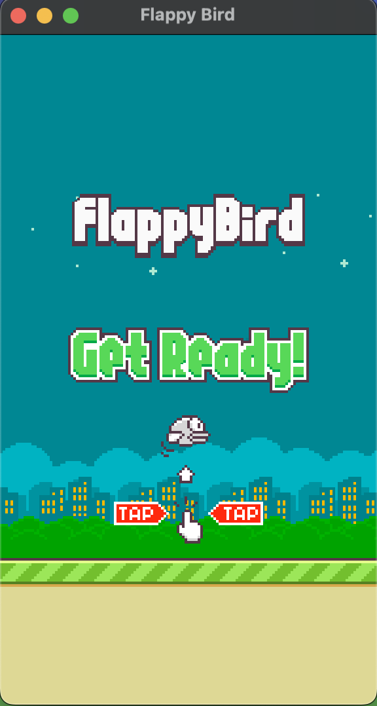
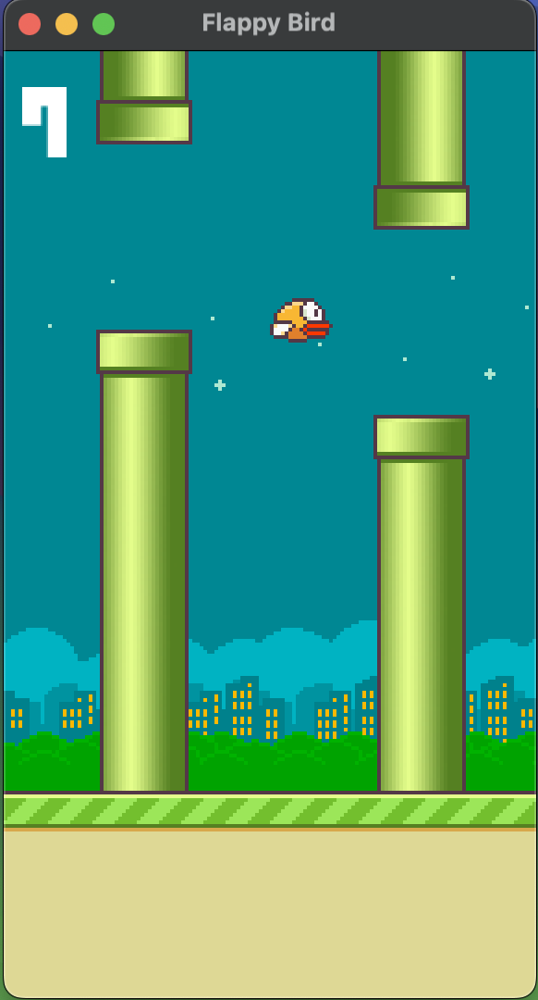
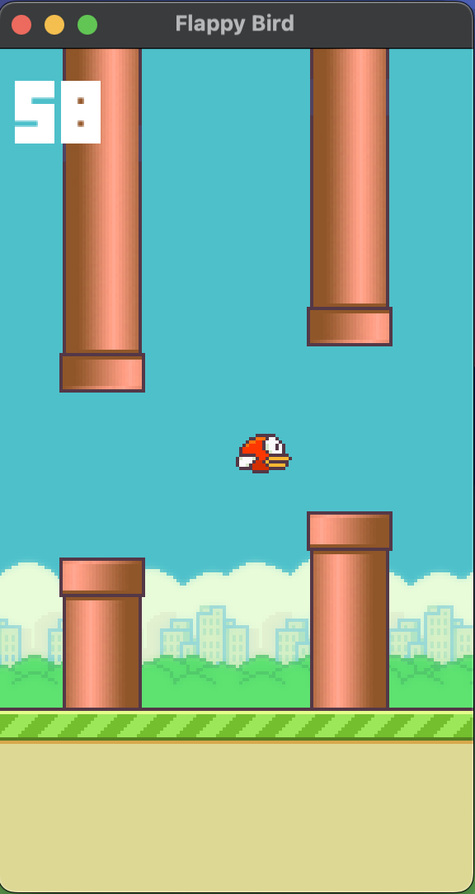

# Flappy Bird Clone

This is a Flappy Bird clone implemented in C++ using SFML graphic library. This project is a way for me to start learning game development.

<div style="display:flex; justify-content:center;">
    
    
    
</div>

## Installation
To run this game, you need to have SFML installed. You can install it using the following command, or visit [SFML tutorials](https://www.sfml-dev.org/tutorials/2.6/) for more info:

### Linux (Ubuntu/Debian)
Install SFML using the package manager:

```bash
sudo apt-get install libsfml-dev
```

### macOS
Install SFML using Homebrew:

```bash
brew install sfml
```

### Windows
1. Download the SFML SDK from the [SFML website](https://www.sfml-dev.org/download.php) and extract it to a location on your computer.
2. Add the SFML binaries to your system's PATH:
   - Open the Control Panel and navigate to System and Security > System > Advanced system settings > Environment Variables.
   - In the System variables section, select the Path variable and click Edit.
   - Click New and add the path to the SFML binaries (e.g., `C:\path\to\SFML\bin`).
   - Click OK to save the changes.

```bash
sudo apt-get install libsfml-dev
```

## How to run
After installing SFML, clone my repository using git clone:

```bash
git clone https://github.com/orca1018/flappy-bird-clone/
```

### Linux/macOS
Compile `main.cpp` with the GCC compiler:

```bash
g++ -std=c++14 -O2 main.cpp -o flappy-bird -lsfml-graphics -lsfml-window -lsfml-system -lsfml-audio
```
or with custom SFML path:  

```bash
g++ -std=c++14 -O2 main.cpp -o flappy-bird -I/full/path/to/SFML/include -L/full/path/to/SFML/lib -lsfml-graphics -lsfml-window -lsfml-system -lsfml-audio

```

Replace `/full/path/to/SFML/include` with the actual path to the SFML include directory.
Run the executable file:

```bash
./flappy-bird
```

### Windows
Compile `main.cpp` with MinGW or another GCC distribution:
```bash
g++ -std=c++14 -O2 main.cpp -o flappy-bird.exe -I/C/path/to/SFML/include -L/C/path/to/SFML/lib -lsfml-graphics -lsfml-window -lsfml-system -lsfml-audio
```

Replace `/C/path/to/SFML/include` with the actual path to the SFML include directory.

Run the executable file `flappy-bird.exe`.

## Customization
You can customize the game's appearance and behavior by modifying the settings in the `settings` function and 'physics' structure in the `main.cpp` file. Here are some settings you can change:

- **Flappy Bird**: Change the appearance or behavior of the Flappy Bird character, such as its speed, gravity or flap strength.

- **Background**: Customize the background of the game, day and night.

- **Pipes**: Modify the pipes' appearance (green or red), spacing, or speed.

Feel free to experiment with different settings to make the game your own!
